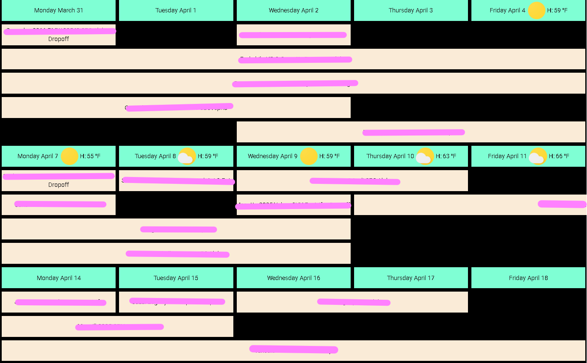

# Week Planner Card


Custom Home Assistant card displaying a responsive overview of multiple days with events from one or multiple calendars



## Table of Content

- [Installation](#installation)
  - [HACS (Recommended)](#hacs-recommended)
  - [Manual](#manual)
- [Configuration](#configuration)
  - [Main options](#main-options)
  - [Calendars](#calendars)
  - [Texts](#texts)
  - [Weather](#weather)
- [Custom styling using cardmod](#custom-styling-using-cardmod)
- [Examples](#examples)

## Installation

### HACS (Recommended)

1. Make sure [HACS](https://hacs.xyz) is installed and working.
2. Search for `week-planner-card`.
3. Download and install using HACS.

### Manual

1. Download and copy `four-week-planner-card.js` from the [latest release](https://github.com/NH-Pro-Wifi/four-week-planner-card/releases/latest) into your `config/www` directory.
2. Add the resource reference to Home Assistant configuration using one of these methods:
  - **Edit your configuration.yaml**
    Add:
    ```yaml
    resources:
      - url: /local/four-week-planner-card.js?version=1.0.0
    type: module
    ```
  - **Using the graphical editor**
    1. Make sure advanced mode is enabled in your user profile
    2. Navigate to "Settings" -> "Dashboards".
    3. Click on the 3 vertical dots in the top right corner and select "Resources".
    4. Click on the "Add resource" button in the bottom right corner.
    5. Enter URL `/local/four-week-planner-card.js` and select type "JavaScript Module".
    6. Restart Home Assistant.


## Configuration

### Main Options

| Name                     | Type             | Default                                            | Supported options                                                                                                                           | Description                                                                            | Version |
|--------------------------|------------------|----------------------------------------------------|---------------------------------------------------------------------------------------------------------------------------------------------|----------------------------------------------------------------------------------------|---------|
| `type`                   | string           | **Required**                                       | `custom:week-planner-card`                                                                                                                  | Type of the card                                                                       | 1.0.0   |
| `startingDay`            | string           | `today`                                            | `sunday` \| `monday` \| `tuesday` \| `wednesday` \| `thursday` \| `friday` \| `saturday` \| `month` | Day to start with                                                                      | 1.2.0   |
| `startingDayOffset`      | number           | 0                                                  | Any integer number                                                                                                                          | Add or subtract days from starting day                                                 | 1.7.0   |

### Calendars

| Name              | Type    | Default      | Supported options      | Description                                            | Version |
|-------------------|---------|--------------|------------------------|--------------------------------------------------------|---------|
| `entity`          | string  | **Required** | `calendar.my_calendar` | Entity ID                                              | 1.0.0   |


### Actions
See [Actions documentation](https://www.home-assistant.io/dashboards/actions/). Currently only the tab action is supported.

### Weather

| Name                 | Type    | Default      | Supported options            | Description                                                                    | Version |
|----------------------|---------|--------------|------------------------------|--------------------------------------------------------------------------------|---------|
| `entity`             | string  | **Required** | `weather.my_weather_service` | Entity ID                                                                      | 1.1.0   |

## Examples

### Minimal

```yaml
type: custom:four-week-planner-card
calendars:
  - entity: calendar.my_calendar_1
```

### Extended

```yaml
type: custom:four-week-planner-card
calendars:
  - entity: calendar.my_calendar_1
  - entity: calendar.my_calendar_2
weather:
  entity: weather.my_weather_service
startingDayOffset: 28
```
